# Pawmise

**A cat-matching mobile application** that helps cat owners find compatible breeding partners for their cats. Built with React Native (Expo) on the frontend and Express.js with MongoDB on the backend, Pawmise features Tinder-style swiping, location-based matching, real-time chat via Socket.IO, and a daily interest system — all wrapped in a soft pink UI designed for cat lovers.

## Table of Contents

- [Features](#features)
- [Screenshots](#screenshots)
- [Tech Stack](#tech-stack)
- [Project Structure](#project-structure)
- [Getting Started](#getting-started)
- [Role-Based Access](#role-based-access)

## Features

### Cat Owner (User)

- **Multi-Step Registration** — 4-step onboarding with avatar upload, email/phone, GPS location, and password setup.
- **Cat Profile Management** — Create, edit, and delete cat profiles with up to 5 photos, breed, age, traits, vaccination status, and notes.
- **Swipe Feed** — Tinder-style swiping through cats of the opposite gender; swipe right to like, up to show special interest, left to pass.
- **Location-Based Matching** — Four matching modes (strict GPS, flexible, province-based, unlimited) automatically chosen based on available location data.
- **Interest System** — Daily-limited "interested" action (1 per cat per day) for more thoughtful connections.
- **Auto-Matching** — Mutual likes or interests automatically create a match between two cats.
- **Real-Time Chat** — Socket.IO-powered messaging with typing indicators, read receipts, and unread badges.
- **Interests Dashboard** — View sent and received interests with the ability to "interest back" directly.
- **Profile Editing** — Update username, phone, avatar, and location at any time.
- **Dark Mode** — Toggle between light and dark themes, persisted in local storage.
- **Account Deletion** — Full cascading delete of user data, cats, swipes, matches, messages, and Cloudinary images.

## Screenshots

### Authentication

| Login | Register (1/4) Account | Register (2/4) Avatar |
|:---:|:---:|:---:|
| 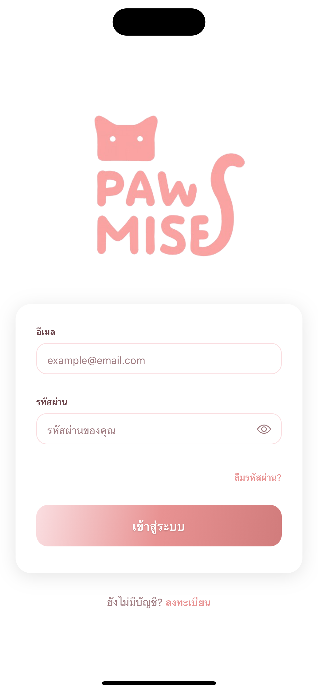 | 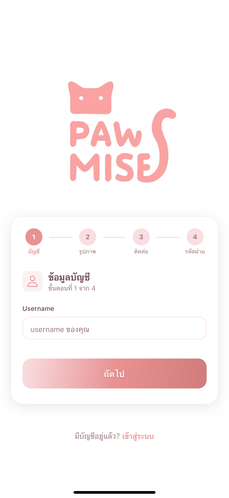 | 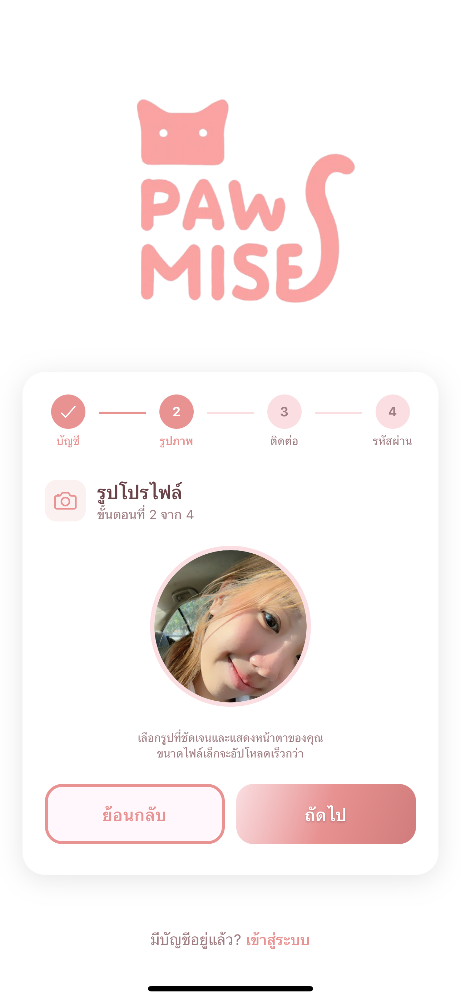 |

| Register (3/4) Contact & Location | Allow Location Permission | Register (4/4) Password |
|:---:|:---:|:---:|
| 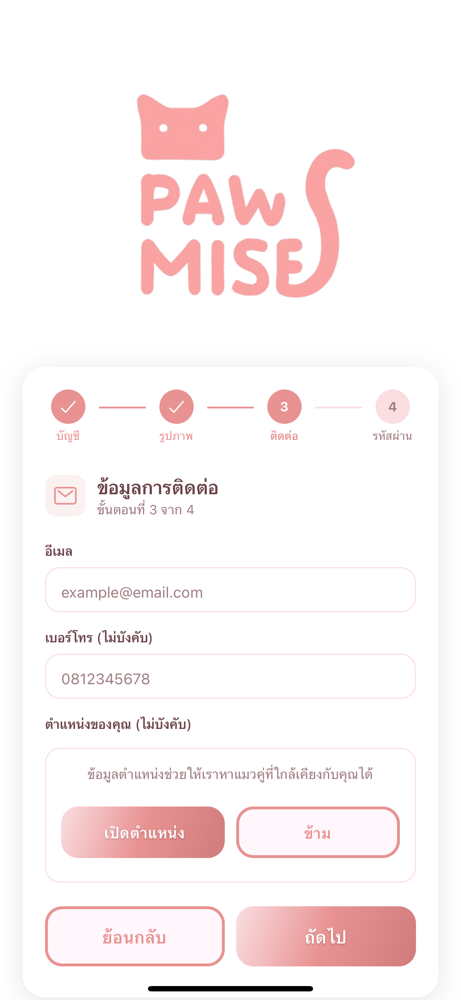 | 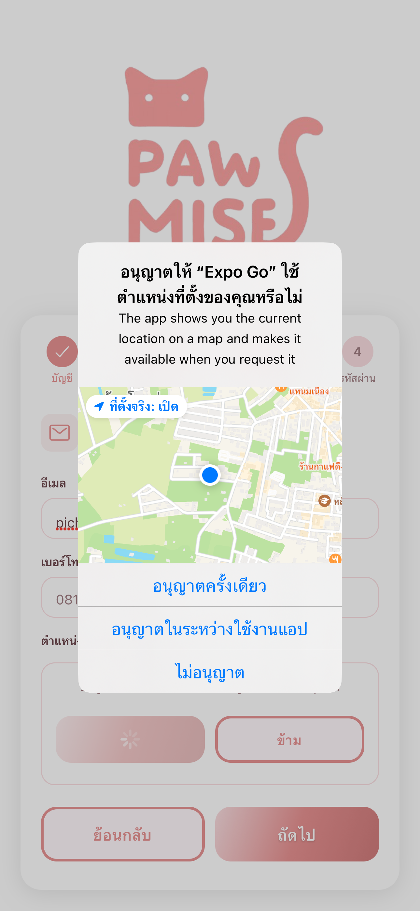 | 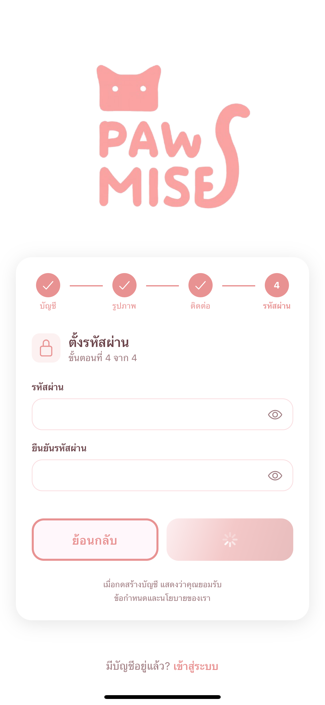 |

### Cat Profile Setup

| Add Cat (1/4) Photos | Add Cat (2/4) Basic Info | Add Cat (3/4) Breed & Health |
|:---:|:---:|:---:|
| 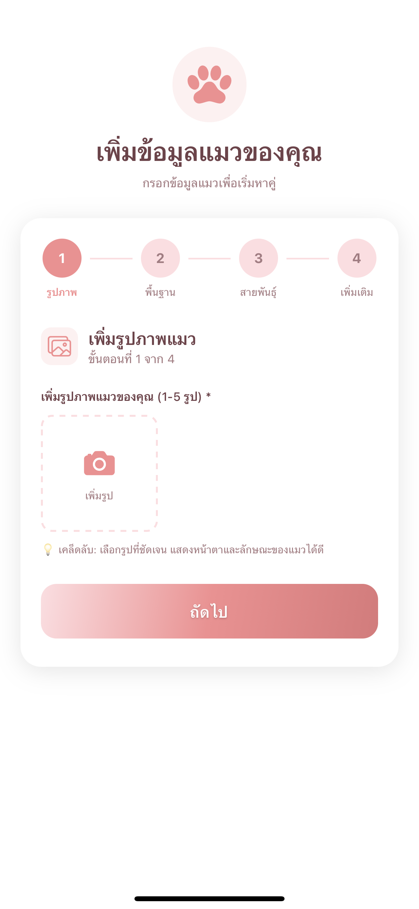 | 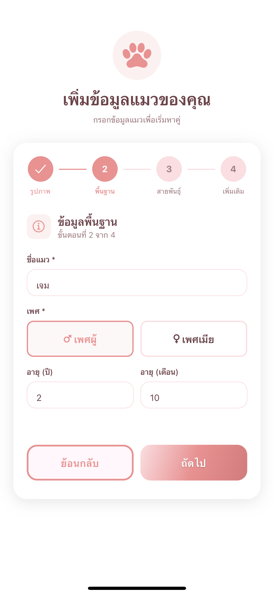 | 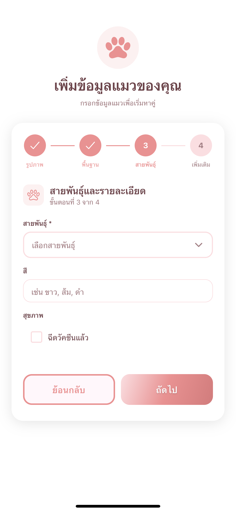 |

| Breed Picker | Add Cat (4/4) Traits & Notes |
|:---:|:---:|
| 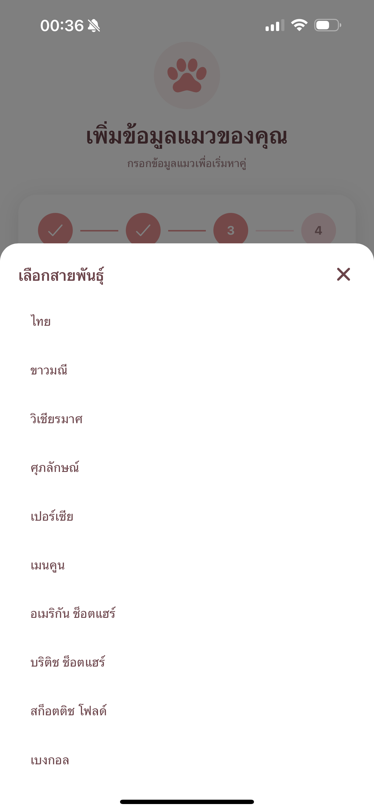 | 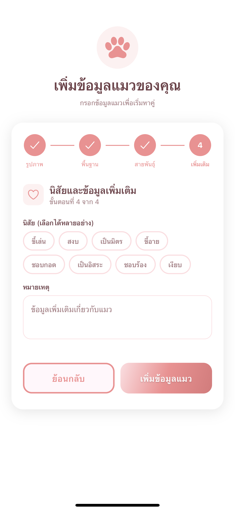 |

### Core Features

| Swipe Feed | It's a Match! | Messages List | Chat |
|:---:|:---:|:---:|:---:|
| 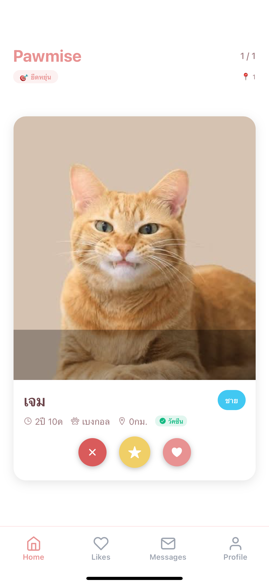 | 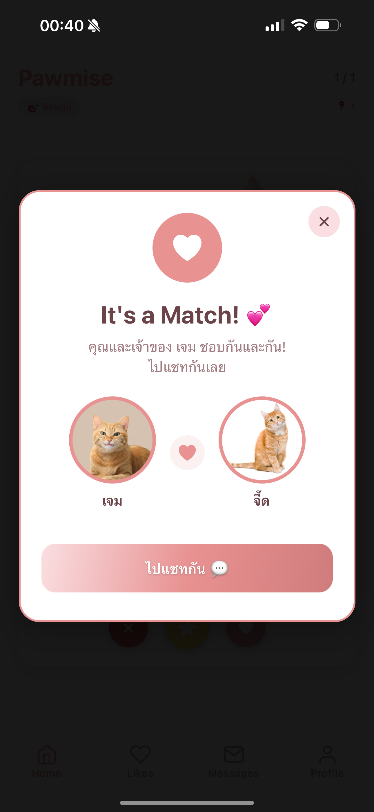 | 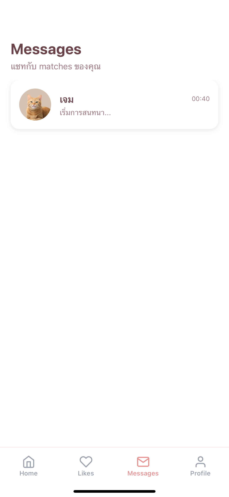 | 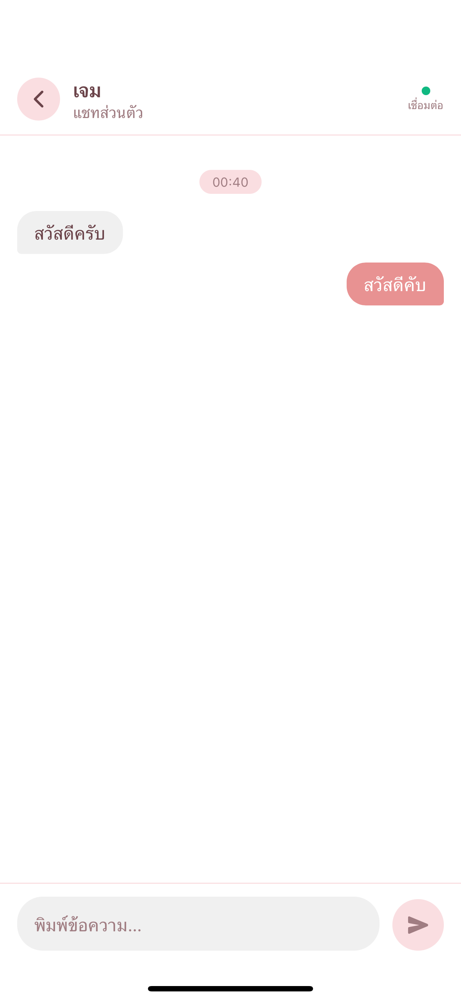 |

## Tech Stack

| Layer | Technology |
|---|---|
| **Frontend** | React Native 0.81, Expo 54, TypeScript 5.9 |
| **Styling** | Tailwind CSS 3.4 + NativeWind 4.2 |
| **Navigation** | Expo Router 6 (file-based), React Navigation 7 |
| **State** | React Context API, AsyncStorage |
| **Backend** | Node.js, Express 5 |
| **Database** | MongoDB with Mongoose 8 |
| **Auth** | JWT (jsonwebtoken) + bcryptjs |
| **Validation** | express-validator |
| **Real-Time** | Socket.IO 4.8 |
| **Image Storage** | Cloudinary + Multer |
| **Geolocation** | geolib + expo-location |
| **Animations** | react-native-reanimated, react-native-gesture-handler |

## Project Structure

```
pawmise/
├── doc/                                  # Project documentation
│   ├── PJ_2DS-B05_Presentation.pdf
│   └── PJ_2DS-B05_Report.pdf
└── sourceCode/
    ├── backend_cat-tinder/
    │   ├── package.json
    │   ├── .env                          # Environment variables
    │   └── src/
    │       ├── server.js                 # Express + Socket.IO entry point
    │       ├── config/
    │       │   └── db.js                 # MongoDB connection
    │       ├── middleware/
    │       │   └── authMiddleware.js     # JWT protect middleware
    │       ├── models/
    │       │   ├── Owner.js              # User account schema
    │       │   ├── Cat.js                # Cat profile schema
    │       │   ├── Swipe.js              # Like/interest/pass records
    │       │   ├── Match.js              # Matched cat pairs
    │       │   └── Message.js            # Chat messages
    │       ├── controllers/
    │       │   ├── authController.js     # Register, login, logout, delete
    │       │   ├── ownersController.js   # Profile & onboarding
    │       │   ├── catsController.js     # CRUD + feed algorithm
    │       │   ├── swipesController.js   # Swipe logic & interest limits
    │       │   ├── matchesController.js  # Match listing & deletion
    │       │   └── messagesController.js # Send, fetch, mark-read
    │       ├── routes/
    │       │   ├── authRoute.js          # /api/auth/*
    │       │   ├── ownersRoute.js        # /api/owners/*
    │       │   ├── catsRoute.js          # /api/cats/*
    │       │   ├── swipesRoute.js        # /api/swipes/*
    │       │   ├── matchesRoute.js       # /api/matches/*
    │       │   └── messagesRoute.js      # /api/messages/*
    │       ├── utils/
    │       │   ├── imageUpload.js        # Multer + Cloudinary helpers
    │       │   ├── cloudinary.js         # Cloudinary config
    │       │   └── geolocation.js        # Distance & matching modes
    │       └── socket/
    │           └── socketServer.js       # Socket.IO events & rooms
    └── frontend_cat-tinder/
        ├── package.json
        ├── app.json                      # Expo config
        ├── tailwind.config.js            # NativeWind theme
        ├── tsconfig.json
        ├── app/
        │   ├── index.tsx                 # Auth redirect entry point
        │   ├── _layout.tsx               # Root providers (Auth, Theme, Socket)
        │   ├── (auth)/
        │   │   ├── _layout.tsx           # Auth stack navigator
        │   │   ├── login.tsx             # Login page
        │   │   ├── register.tsx          # 4-step registration
        │   │   ├── add-cat.tsx           # 4-step cat creation
        │   │   └── edit-cat.tsx          # Edit cat profile
        │   ├── (tabs)/
        │   │   ├── _layout.tsx           # Bottom tab navigator
        │   │   ├── home.tsx              # Swipe feed screen
        │   │   ├── like.tsx              # Interests sent/received
        │   │   ├── messages.tsx          # Match list + last messages
        │   │   └── profile.tsx           # User profile + cat management
        │   └── chat/
        │       └── [matchId].tsx         # Real-time chat screen
        ├── components/
        │   ├── SwipeableCard.tsx          # Gesture-driven cat card
        │   ├── CatDetailModal.tsx         # Full cat profile modal
        │   ├── CatViewModal.tsx           # Cat view with actions
        │   ├── AddCatModal.tsx            # Add cat modal
        │   ├── MatchModal.tsx             # Match celebration overlay
        │   ├── PinkButton.tsx             # Themed button component
        │   └── ThaiInput.tsx              # Thai-language text input
        ├── contexts/
        │   ├── AuthContext.tsx             # JWT auth state & methods
        │   ├── ThemeContext.tsx            # Light/dark theme toggle
        │   └── SocketContext.tsx           # Socket.IO connection
        ├── services/
        │   └── api.ts                     # Axios client & all API calls
        ├── constants/
        │   └── config.ts                  # API URLs & storage keys
        ├── types/
        │   └── index.ts                   # TypeScript interfaces
        ├── utils/
        │   └── eventEmitter.ts            # Cross-component events
        └── assets/
            ├── images/                    # App logos & icons
            ├── icons/                     # SVG icons
            └── fonts/                     # Custom TTF fonts
```

## Getting Started

### Prerequisites

| Tool | Version |
|---|---|
| Node.js | >= 18 |
| MongoDB | >= 6 (local or Atlas) |
| Expo CLI | `npx expo` (bundled with Expo SDK 54) |
| Cloudinary Account | For image uploads |

### Installation

1. **Clone the repository**
   ```bash
   git clone https://github.com/<your-username>/pawmise.git
   cd pawmise
   ```

2. **Install backend dependencies**
   ```bash
   cd sourceCode/backend_cat-tinder
   npm install
   ```

3. **Configure backend environment**

   Create a `.env` file in `sourceCode/backend_cat-tinder/`:
   ```env
   PORT=5000
   NODE_ENV=development
   MONGODB_URI=mongodb://localhost:27017/pawmise
   JWT_SECRET=<your-random-secret>
   JWT_EXPIRE=7d
   CLOUDINARY_CLOUD_NAME=<your-cloud-name>
   CLOUDINARY_API_KEY=<your-api-key>
   CLOUDINARY_API_SECRET=<your-api-secret>
   CORS_ORIGIN=*
   ```

4. **Install frontend dependencies**
   ```bash
   cd ../frontend_cat-tinder
   npm install
   ```

5. **Configure frontend API URL**

   Edit `constants/config.ts` and set your backend URL (e.g., `http://localhost:5000/api` or your LAN IP for physical devices).

6. **Start MongoDB** (if running locally)
   ```bash
   mongod
   ```

7. **Start the backend**
   ```bash
   cd sourceCode/backend_cat-tinder
   npm run dev
   ```

8. **Start the frontend**
   ```bash
   cd sourceCode/frontend_cat-tinder
   npx expo start
   ```

### Available Scripts

#### Backend (`sourceCode/backend_cat-tinder/`)

| Script | Command | Description |
|---|---|---|
| `dev` | `npm run dev` | Start server with `--watch` (auto-restart) |
| `start` | `npm start` | Start server for production |

#### Frontend (`sourceCode/frontend_cat-tinder/`)

| Script | Command | Description |
|---|---|---|
| `start` | `npm start` | Launch Expo dev server |
| `android` | `npm run android` | Run on Android emulator/device |
| `ios` | `npm run ios` | Run on iOS simulator/device |
| `web` | `npm run web` | Run in web browser |
| `lint` | `npm run lint` | Run ESLint |

## Role-Based Access

Pawmise uses a single **Owner** role with JWT-based authentication. Access control is enforced through ownership validation rather than role hierarchy.

| Role | Access Path | Description |
|---|---|---|
| **Guest** | `/(auth)/login`, `/(auth)/register` | Unauthenticated users can only access login and registration. |
| **Owner (pre-onboarding)** | `/(auth)/add-cat` | After registration, redirected to create first cat profile. |
| **Owner (active)** | `/(tabs)/*`, `/chat/*` | Full access to swiping, interests, matches, messaging, and profile management. |

### How Auth/Authorization Works

1. **Registration** creates an Owner document and returns a JWT token (expires in 7 days).
2. **Every protected API route** passes through the `protect` middleware, which verifies the `Authorization: Bearer <token>` header and decodes the user ID from the JWT payload.
3. **Ownership checks** are performed at the controller level — users can only modify their own cats, view their own matches, and send messages in matches they participate in.
4. **Frontend routing** uses Expo Router's file-based layout with an `AuthContext` that checks for a stored token on app launch, validates it via `GET /api/auth/me`, and automatically redirects unauthenticated users to the login screen.
5. **Socket.IO connections** authenticate via JWT passed during the handshake; unauthenticated socket connections are rejected.
