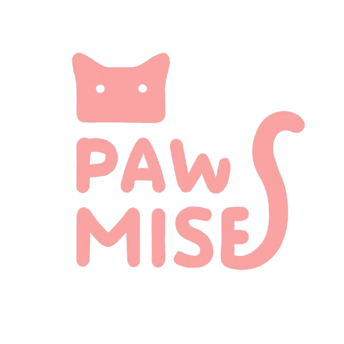

# Pawmise

**A cat-matching mobile application** that helps cat owners find compatible breeding partners for their cats. Built with React Native (Expo) on the frontend and Express.js with MongoDB on the backend, Pawmise features Tinder-style swiping, location-based matching, real-time chat via Socket.IO, and a daily interest system — all wrapped in a soft pink UI designed for cat lovers.

---

## Table of Contents

- [Features](#features)
- [Screenshots](#screenshots)
- [Tech Stack](#tech-stack)
- [Project Structure](#project-structure)
- [Getting Started](#getting-started)
- [Database Schema](#database-schema)
- [API Routes](#api-routes)
- [Role-Based Access](#role-based-access)

---

## Features

### Cat Owner (User)

- **Multi-Step Registration** — 4-step onboarding with avatar upload, email/phone, GPS location, and password setup.
- **Cat Profile Management** — Create, edit, and delete cat profiles with up to 5 photos, breed, age, traits, vaccination status, and notes.
- **Swipe Feed** — Tinder-style swiping through cats of the opposite gender; swipe right to like, up to show special interest, left to pass.
- **Location-Based Matching** — Four matching modes (strict GPS, flexible, province-based, unlimited) automatically chosen based on available location data.
- **Interest System** — Daily-limited "interested" action (1 per cat per day) for more thoughtful connections.
- **Auto-Matching** — Mutual likes or interests automatically create a match between two cats.
- **Real-Time Chat** — Socket.IO-powered messaging with typing indicators, read receipts, and unread badges.
- **Interests Dashboard** — View sent and received interests with the ability to "interest back" directly.
- **Profile Editing** — Update username, phone, avatar, and location at any time.
- **Dark Mode** — Toggle between light and dark themes, persisted in local storage.
- **Account Deletion** — Full cascading delete of user data, cats, swipes, matches, messages, and Cloudinary images.

---

## Screenshots

> The project uses Cloudinary for dynamic user-uploaded images. Below are the app's static assets:

| App Logo | Splash Screen | Cat Loft |
|:---:|:---:|:---:|
|  |  |  |

| App Icon | Favicon | Android Foreground |
|:---:|:---:|:---:|
|  |  |  |

---

## Tech Stack

| Layer | Technology |
|---|---|
| **Frontend** | React Native 0.81, Expo 54, TypeScript 5.9 |
| **Styling** | Tailwind CSS 3.4 + NativeWind 4.2 |
| **Navigation** | Expo Router 6 (file-based), React Navigation 7 |
| **State** | React Context API, AsyncStorage |
| **Backend** | Node.js, Express 5 |
| **Database** | MongoDB with Mongoose 8 |
| **Auth** | JWT (jsonwebtoken) + bcryptjs |
| **Validation** | express-validator |
| **Real-Time** | Socket.IO 4.8 |
| **Image Storage** | Cloudinary + Multer |
| **Geolocation** | geolib + expo-location |
| **Animations** | react-native-reanimated, react-native-gesture-handler |

---

## Project Structure

```
pawmise/
├── doc/                                  # Project documentation
│   ├── PJ_2DS-B05_Presentation.pdf
│   └── PJ_2DS-B05_Report.pdf
└── sourceCode/
    ├── backend_cat-tinder/
    │   ├── package.json
    │   ├── .env                          # Environment variables
    │   └── src/
    │       ├── server.js                 # Express + Socket.IO entry point
    │       ├── config/
    │       │   └── db.js                 # MongoDB connection
    │       ├── middleware/
    │       │   └── authMiddleware.js     # JWT protect middleware
    │       ├── models/
    │       │   ├── Owner.js              # User account schema
    │       │   ├── Cat.js                # Cat profile schema
    │       │   ├── Swipe.js              # Like/interest/pass records
    │       │   ├── Match.js              # Matched cat pairs
    │       │   └── Message.js            # Chat messages
    │       ├── controllers/
    │       │   ├── authController.js     # Register, login, logout, delete
    │       │   ├── ownersController.js   # Profile & onboarding
    │       │   ├── catsController.js     # CRUD + feed algorithm
    │       │   ├── swipesController.js   # Swipe logic & interest limits
    │       │   ├── matchesController.js  # Match listing & deletion
    │       │   └── messagesController.js # Send, fetch, mark-read
    │       ├── routes/
    │       │   ├── authRoute.js          # /api/auth/*
    │       │   ├── ownersRoute.js        # /api/owners/*
    │       │   ├── catsRoute.js          # /api/cats/*
    │       │   ├── swipesRoute.js        # /api/swipes/*
    │       │   ├── matchesRoute.js       # /api/matches/*
    │       │   └── messagesRoute.js      # /api/messages/*
    │       ├── utils/
    │       │   ├── imageUpload.js        # Multer + Cloudinary helpers
    │       │   ├── cloudinary.js         # Cloudinary config
    │       │   └── geolocation.js        # Distance & matching modes
    │       └── socket/
    │           └── socketServer.js       # Socket.IO events & rooms
    └── frontend_cat-tinder/
        ├── package.json
        ├── app.json                      # Expo config
        ├── tailwind.config.js            # NativeWind theme
        ├── tsconfig.json
        ├── app/
        │   ├── index.tsx                 # Auth redirect entry point
        │   ├── _layout.tsx               # Root providers (Auth, Theme, Socket)
        │   ├── (auth)/
        │   │   ├── _layout.tsx           # Auth stack navigator
        │   │   ├── login.tsx             # Login page
        │   │   ├── register.tsx          # 4-step registration
        │   │   ├── add-cat.tsx           # 4-step cat creation
        │   │   └── edit-cat.tsx          # Edit cat profile
        │   ├── (tabs)/
        │   │   ├── _layout.tsx           # Bottom tab navigator
        │   │   ├── home.tsx              # Swipe feed screen
        │   │   ├── like.tsx              # Interests sent/received
        │   │   ├── messages.tsx          # Match list + last messages
        │   │   └── profile.tsx           # User profile + cat management
        │   └── chat/
        │       └── [matchId].tsx         # Real-time chat screen
        ├── components/
        │   ├── SwipeableCard.tsx          # Gesture-driven cat card
        │   ├── CatDetailModal.tsx         # Full cat profile modal
        │   ├── CatViewModal.tsx           # Cat view with actions
        │   ├── AddCatModal.tsx            # Add cat modal
        │   ├── MatchModal.tsx             # Match celebration overlay
        │   ├── PinkButton.tsx             # Themed button component
        │   └── ThaiInput.tsx              # Thai-language text input
        ├── contexts/
        │   ├── AuthContext.tsx             # JWT auth state & methods
        │   ├── ThemeContext.tsx            # Light/dark theme toggle
        │   └── SocketContext.tsx           # Socket.IO connection
        ├── services/
        │   └── api.ts                     # Axios client & all API calls
        ├── constants/
        │   └── config.ts                  # API URLs & storage keys
        ├── types/
        │   └── index.ts                   # TypeScript interfaces
        ├── utils/
        │   └── eventEmitter.ts            # Cross-component events
        └── assets/
            ├── images/                    # App logos & icons
            ├── icons/                     # SVG icons
            └── fonts/                     # Custom TTF fonts
```

---

## Getting Started

### Prerequisites

| Tool | Version |
|---|---|
| Node.js | >= 18 |
| MongoDB | >= 6 (local or Atlas) |
| Expo CLI | `npx expo` (bundled with Expo SDK 54) |
| Cloudinary Account | For image uploads |

### Installation

1. **Clone the repository**
   ```bash
   git clone https://github.com/<your-username>/pawmise.git
   cd pawmise
   ```

2. **Install backend dependencies**
   ```bash
   cd sourceCode/backend_cat-tinder
   npm install
   ```

3. **Configure backend environment**

   Create a `.env` file in `sourceCode/backend_cat-tinder/`:
   ```env
   PORT=5000
   NODE_ENV=development
   MONGODB_URI=mongodb://localhost:27017/pawmise
   JWT_SECRET=<your-random-secret>
   JWT_EXPIRE=7d
   CLOUDINARY_CLOUD_NAME=<your-cloud-name>
   CLOUDINARY_API_KEY=<your-api-key>
   CLOUDINARY_API_SECRET=<your-api-secret>
   CORS_ORIGIN=*
   ```

4. **Install frontend dependencies**
   ```bash
   cd ../frontend_cat-tinder
   npm install
   ```

5. **Configure frontend API URL**

   Edit `constants/config.ts` and set your backend URL (e.g., `http://localhost:5000/api` or your LAN IP for physical devices).

6. **Start MongoDB** (if running locally)
   ```bash
   mongod
   ```

7. **Start the backend**
   ```bash
   cd sourceCode/backend_cat-tinder
   npm run dev
   ```

8. **Start the frontend**
   ```bash
   cd sourceCode/frontend_cat-tinder
   npx expo start
   ```

### Available Scripts

#### Backend (`sourceCode/backend_cat-tinder/`)

| Script | Command | Description |
|---|---|---|
| `dev` | `npm run dev` | Start server with `--watch` (auto-restart) |
| `start` | `npm start` | Start server for production |

#### Frontend (`sourceCode/frontend_cat-tinder/`)

| Script | Command | Description |
|---|---|---|
| `start` | `npm start` | Launch Expo dev server |
| `android` | `npm run android` | Run on Android emulator/device |
| `ios` | `npm run ios` | Run on iOS simulator/device |
| `web` | `npm run web` | Run in web browser |
| `lint` | `npm run lint` | Run ESLint |

---

## Database Schema

### Entity-Relationship Diagram

```
┌──────────┐       1:N       ┌──────────┐
│  Owner   │────────────────▶│   Cat    │
│          │                 │          │
│ _id (PK) │                 │ _id (PK) │
│ email    │                 │ ownerId  │──(FK → Owner)
│ username │                 │ name     │
│ password │                 │ gender   │
│ phone    │                 │ breed    │
│ avatar   │                 │ photos[] │
│ location │                 │ traits[] │
│ onboard  │                 │ location │
└──────────┘                 └──────────┘
      │                        │      │
      │  1:N                   │      │
      ▼                        │      │
┌──────────┐                   │      │
│  Match   │◀──────────────────┘      │
│          │   catAId (FK → Cat)      │
│ _id (PK) │   catBId (FK → Cat)     │
│ ownerAId │──(FK → Owner)           │
│ ownerBId │──(FK → Owner)           │
│ lastMsg  │                          │
└──────────┘                          │
      │                               │
      │ 1:N                           │
      ▼                               │
┌──────────┐                          │
│ Message  │                          │
│          │                          │
│ _id (PK) │                          │
│ matchId  │──(FK → Match)            │
│ senderId │──(FK → Owner)            │
│ text     │                          │
│ read     │                          │
│ sentAt   │                          │
└──────────┘                          │
                                      │
┌──────────┐                          │
│  Swipe   │◀─────────────────────────┘
│          │   swiperCatId (FK → Cat)
│ _id (PK) │   targetCatId (FK → Cat)
│ swiperId │──(FK → Owner)
│ action   │   [like | interested | pass]
└──────────┘
```

### Key Models

| Model | Description |
|---|---|
| **Owner** | User account with profile info, avatar, GPS location, and onboarding status. |
| **Cat** | Cat profile with photos, breed, traits, age, health status, and breeding readiness. |
| **Swipe** | Records each swipe action (like, interested, pass) between two cats. |
| **Match** | Created automatically when two cats mutually like/interest each other. |
| **Message** | Individual chat messages within a match, with read tracking. |

### Owner

| Column | Type | Constraints |
|---|---|---|
| `_id` | ObjectId | Primary Key (auto) |
| `email` | String | required, unique, indexed, lowercase, trimmed |
| `passwordHash` | String | required |
| `username` | String | required, unique, indexed, trimmed |
| `phone` | String | optional |
| `avatar.url` | String | required |
| `avatar.publicId` | String | optional |
| `location.province` | String | default: `''` |
| `location.district` | String | optional |
| `location.lat` | Number | default: `0` |
| `location.lng` | Number | default: `0` |
| `onboardingCompleted` | Boolean | default: `false` |
| `active` | Boolean | default: `true` |
| `interestUsage.date` | Date | optional |
| `interestUsage.count` | Number | default: `0` |
| `createdAt` | Date | auto (timestamps) |
| `updatedAt` | Date | auto (timestamps) |

### Cat

| Column | Type | Constraints |
|---|---|---|
| `_id` | ObjectId | Primary Key (auto) |
| `ownerId` | ObjectId | required, indexed, ref → Owner |
| `name` | String | required, trimmed |
| `gender` | String | required, indexed, enum: `male`, `female` |
| `ageYears` | Number | min: 0, default: `0` |
| `ageMonths` | Number | min: 0, max: 11, default: `0` |
| `breed` | String | required |
| `color` | String | optional |
| `traits` | [String] | enum: `playful`, `calm`, `friendly`, `shy`, `affectionate`, `independent`, `vocal`, `quiet` |
| `photos[].url` | String | required |
| `photos[].publicId` | String | optional |
| `readyForBreeding` | Boolean | default: `true` |
| `vaccinated` | Boolean | default: `false` |
| `neutered` | Boolean | default: `false` |
| `notes` | String | optional |
| `location.province` | String | default: `''` |
| `location.district` | String | optional |
| `location.lat` | Number | default: `0` |
| `location.lng` | Number | default: `0` |
| `active` | Boolean | default: `true`, indexed |
| `interestUsage.date` | Date | default: `null` |
| `interestUsage.count` | Number | default: `0` |
| `createdAt` | Date | auto (timestamps) |
| `updatedAt` | Date | auto (timestamps) |

### Swipe

| Column | Type | Constraints |
|---|---|---|
| `_id` | ObjectId | Primary Key (auto) |
| `swiperOwnerId` | ObjectId | required, indexed, ref → Owner |
| `swiperCatId` | ObjectId | required, indexed, ref → Cat |
| `targetCatId` | ObjectId | required, indexed, ref → Cat |
| `action` | String | required, enum: `like`, `interested`, `pass` |
| `createdAt` | Date | auto (timestamps) |

**Unique index:** `{ swiperOwnerId, swiperCatId, targetCatId }`

### Match

| Column | Type | Constraints |
|---|---|---|
| `_id` | ObjectId | Primary Key (auto) |
| `catAId` | ObjectId | required, indexed, ref → Cat |
| `ownerAId` | ObjectId | required, indexed, ref → Owner |
| `catBId` | ObjectId | required, indexed, ref → Cat |
| `ownerBId` | ObjectId | required, indexed, ref → Owner |
| `lastMessageAt` | Date | default: `null`, indexed |
| `createdAt` | Date | auto (timestamps) |

**Unique index:** `{ catAId, catBId }`

### Message

| Column | Type | Constraints |
|---|---|---|
| `_id` | ObjectId | Primary Key (auto) |
| `matchId` | ObjectId | required, indexed, ref → Match |
| `senderOwnerId` | ObjectId | required, indexed, ref → Owner |
| `text` | String | required |
| `read` | Boolean | default: `false`, indexed |
| `sentAt` | Date | auto (createdAt alias) |

---

## API Routes

All protected routes require the header: `Authorization: Bearer <token>`

### Auth (`/api/auth`)

| Method | Endpoint | Description |
|---|---|---|
| `POST` | `/api/auth/register` | Register new account (multipart: avatar image) |
| `POST` | `/api/auth/login` | Login with email & password |
| `GET` | `/api/auth/me` | Get current authenticated user profile |
| `POST` | `/api/auth/logout` | Logout (client-side token removal) |
| `DELETE` | `/api/auth/delete-account` | Delete account with cascading data removal |

### Owners (`/api/owners`)

| Method | Endpoint | Description |
|---|---|---|
| `GET` | `/api/owners/profile` | Get own profile |
| `PUT` | `/api/owners/profile` | Update profile (multipart: optional avatar) |
| `POST` | `/api/owners/avatar` | Upload new avatar image |
| `POST` | `/api/owners/onboarding` | Complete onboarding (username, phone, location) |

### Cats (`/api/cats`)

| Method | Endpoint | Description |
|---|---|---|
| `GET` | `/api/cats/feed` | Get swiping feed (opposite gender, location-filtered) |
| `GET` | `/api/cats/my-cats` | List all cats owned by current user |
| `GET` | `/api/cats/:id` | Get single cat with owner details |
| `POST` | `/api/cats` | Create cat profile (multipart: 1-5 photos) |
| `PUT` | `/api/cats/:id` | Update cat profile (multipart: optional photos) |
| `DELETE` | `/api/cats/:id` | Delete cat and its Cloudinary images |

### Swipes (`/api/swipes`)

| Method | Endpoint | Description |
|---|---|---|
| `POST` | `/api/swipes` | Create swipe (like, interested, or pass); auto-matches on mutual |
| `GET` | `/api/swipes/likes-sent/:catId` | Get all interests sent by a cat |
| `GET` | `/api/swipes/likes-received/:catId` | Get all interests received by a cat |
| `GET` | `/api/swipes/interest-status/:catId` | Check daily interest limit status |
| `DELETE` | `/api/swipes/interest-status/:catId` | Reset interest limit for a cat (debug) |
| `DELETE` | `/api/swipes/interest-status-all` | Reset interest limits for all user's cats (debug) |

### Matches (`/api/matches`)

| Method | Endpoint | Description |
|---|---|---|
| `GET` | `/api/matches` | List all matches (paginated, sorted by last message) |
| `GET` | `/api/matches/:id` | Get single match with full cat & owner details |
| `DELETE` | `/api/matches/:id` | Delete match and all its messages |

### Messages (`/api/messages`)

| Method | Endpoint | Description |
|---|---|---|
| `GET` | `/api/messages/:matchId` | Get messages for a match (cursor-paginated) |
| `POST` | `/api/messages` | Send a message to a match |
| `PUT` | `/api/messages/:matchId/read` | Mark all messages from the other user as read |

### Socket.IO Events

| Event | Direction | Description |
|---|---|---|
| `match:join` | Client → Server | Join a match chat room |
| `match:leave` | Client → Server | Leave a match chat room |
| `message:send` | Client → Server | Send a real-time message |
| `message:read` | Client → Server | Mark messages as read |
| `typing:start` | Client → Server | Broadcast typing indicator |
| `typing:stop` | Client → Server | Clear typing indicator |
| `message:received` | Server → Client | New message in current room |
| `match:new` | Server → Client | New match notification |
| `typing:user` | Server → Client | Typing indicator update |
| `notification:new_message` | Server → Client | Message notification (outside room) |
| `user:online` | Server → Client | User came online |
| `user:offline` | Server → Client | User went offline |

---

## Role-Based Access

Pawmise uses a single **Owner** role with JWT-based authentication. Access control is enforced through ownership validation rather than role hierarchy.

| Role | Access Path | Description |
|---|---|---|
| **Guest** | `/(auth)/login`, `/(auth)/register` | Unauthenticated users can only access login and registration. |
| **Owner (pre-onboarding)** | `/(auth)/add-cat` | After registration, redirected to create first cat profile. |
| **Owner (active)** | `/(tabs)/*`, `/chat/*` | Full access to swiping, interests, matches, messaging, and profile management. |

### How Auth/Authorization Works

1. **Registration** creates an Owner document and returns a JWT token (expires in 7 days).
2. **Every protected API route** passes through the `protect` middleware, which verifies the `Authorization: Bearer <token>` header and decodes the user ID from the JWT payload.
3. **Ownership checks** are performed at the controller level — users can only modify their own cats, view their own matches, and send messages in matches they participate in.
4. **Frontend routing** uses Expo Router's file-based layout with an `AuthContext` that checks for a stored token on app launch, validates it via `GET /api/auth/me`, and automatically redirects unauthenticated users to the login screen.
5. **Socket.IO connections** authenticate via JWT passed during the handshake; unauthenticated socket connections are rejected.
